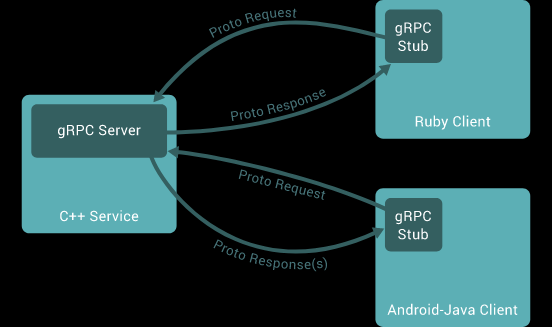

#gRPC Client with Spring Boot

##### This is a simple implementation of gRPC Server locate in this repository: [grpc-server-example](https://github.com/mateusesp/grpc-server-example)

### Steps to build

---
```./mvnw clean package```

---
### Language & Tools
- Java 17
- Spring Boot Framework

---
### Testing request
Run the ```grpc-server-example``` and then run this client to see de response message,
if the username and password is the same, server will return "SUCCESS", 
if they are different values the server will return "FAILED".


### gRPC Diagram Representation:
